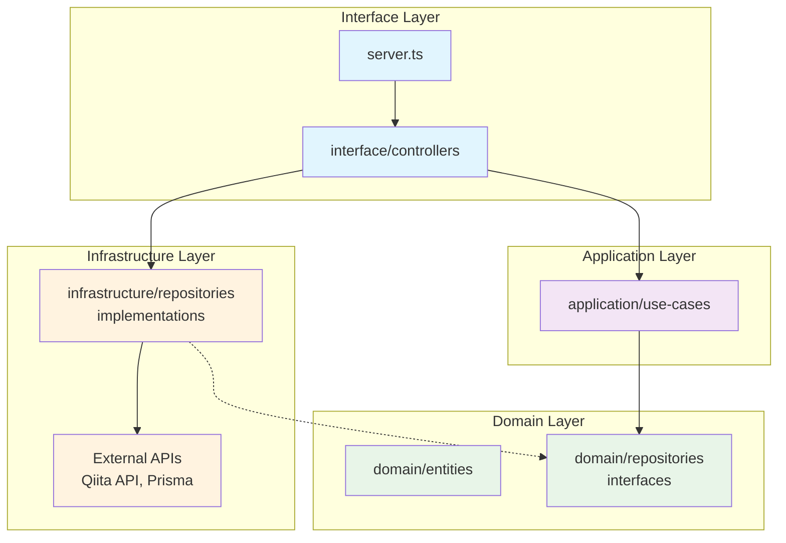

# GraphQL API Server

## Development Setup

### Prerequisites
- Node.js (>=18)
- pnpm
- Docker & Docker Compose

### Installation
```bash
pnpm install
```

### Database Setup

#### Development Database
```bash
# Generate Prisma client
pnpm db:generate

# Run database migrations
pnpm db:migrate
```


### Running Tests

```bash
pnpm test
```

### Available Scripts

- `pnpm dev` - Start development server
- `pnpm build` - Build for production
- `pnpm test` - Run tests
- `pnpm test:ui` - Run tests with UI
- `pnpm db:migrate` - Run database migrations (development)
- `pnpm db:generate` - Generate Prisma client
- `pnpm lint` - Run linting
- `pnpm fmt` - Format code

## Architecture

本プロジェクトはClean Architectureの原則に従って設計されており、責務を明確に分離しています。

### ディレクトリ構造と依存関係



### 各層の責務

#### Domain Layer (`src/domain/`)
- **Entities**: ビジネスロジックの中核となるエンティティ定義
  - `articles/entities/Article.ts`: 記事エンティティ
  - `bookmarks/entities/Bookmark.ts`: ブックマークエンティティ
- **Repository Interfaces**: データアクセスの抽象化
  - `articles/repositories/ArticleRepository.ts`
  - `bookmarks/repositories/BookmarkRepository.ts`

#### Application Layer (`src/application/`)
- **Use Cases**: ビジネスロジックとユースケースの実装
  - `use-cases/articles/FetchArticlesUseCase.ts`
  - `use-cases/bookmarks/` (CRUD operations)

#### Infrastructure Layer (`src/infrastructure/`)
- **Repository Implementations**: 外部システムとの連携実装
  - `repositories/ArticleRepositoryImpl.ts`: Qiita API連携
  - `repositories/BookmarkRepositoryImpl.ts`: Prisma DB連携

#### Interface Layer (`src/interface/`)
- **Controllers**: GraphQLリゾルバーとの連携
  - `controllers/ArticleController.ts`
  - `controllers/BookmarkController.ts`

### 依存関係の原則

1. **依存性逆転**: 上位層は下位層の抽象（インターフェース）に依存
2. **単一責任**: 各層は明確に定義された責務のみを持つ
3. **開放閉鎖**: 新機能追加時は既存コードを変更せず拡張可能

## Database Schema

The application uses Prisma ORM with SQLite. The database schema is defined in `prisma/schema.prisma`.

### Bookmarks Model
```prisma
model Bookmark {
  id          String   @id @default(cuid())
  title       String
  url         String
  description String?
  created_at  DateTime @default(now())
  updated_at  DateTime @updatedAt

  @@map("bookmarks")
}
```