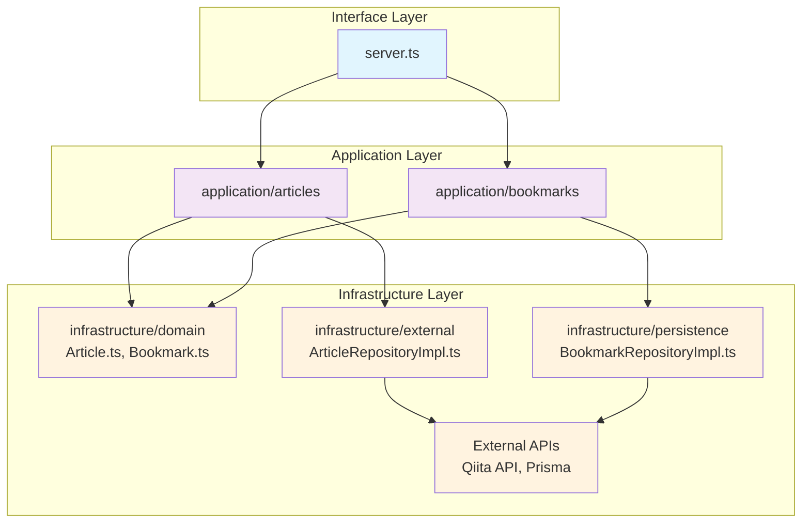

# GraphQL API Server

## Development Setup

### Prerequisites
- Node.js (>=18)
- pnpm
- Docker & Docker Compose

### Installation
```bash
pnpm install
```

### Database Setup

#### Development Database
```bash
# Generate Prisma client
pnpm db:generate

# Run database migrations
pnpm db:migrate
```


### Running Tests

```bash
pnpm test
```

### Available Scripts

- `pnpm dev` - Start development server
- `pnpm build` - Build for production
- `pnpm test` - Run tests
- `pnpm test:ui` - Run tests with UI
- `pnpm db:migrate` - Run database migrations (development)
- `pnpm db:generate` - Generate Prisma client
- `pnpm lint` - Run linting
- `pnpm fmt` - Format code

## Architecture

本プロジェクトはClean Architectureの原則に従って設計されており、責務を明確に分離しています。

### ディレクトリ構造と依存関係



### 各層の責務

#### Application Layer (`src/application/`)
- **Use Cases**: ビジネスロジックとユースケースの実装
  - `articles/FetchArticlesUseCase.ts`: 記事取得ユースケース
  - `bookmarks/`: ブックマークのCRUD操作
    - `CreateBookmarkUseCase.ts`
    - `FetchBookmarksUseCase.ts`
    - `FetchBookmarkByIdUseCase.ts`
    - `UpdateBookmarkUseCase.ts`
    - `DeleteBookmarkUseCase.ts`

#### Infrastructure Layer (`src/infrastructure/`)
- **Domain**: エンティティ定義（簡略化のためinfrastructure層に配置）
  - `domain/Article.ts`: 記事エンティティ
  - `domain/Bookmark.ts`: ブックマークエンティティ
- **External**: 外部API連携実装
  - `external/ArticleRepositoryImpl.ts`: Qiita API連携
- **Persistence**: データベース連携実装
  - `persistence/BookmarkRepositoryImpl.ts`: Prisma DB連携

#### Interface Layer (`src/`)
- **Server**: GraphQLリゾルバーの直接実装
  - `server.ts`: 各ユースケースを直接呼び出すシンプルな構成

### 設計の特徴

1. **TypeScript関数ベース**: クラスではなく関数を使用したシンプルな実装
2. **type定義**: interfaceではなくtype定義を使用
3. **シンプルな構造**: 複雑な抽象化を避け、理解しやすい構成
4. **責任の分離**: 外部API（external）とDB（persistence）の明確な分離
5. **直接的な依存**: ユースケースからrepository実装への直接インポート

## Database Schema

The application uses Prisma ORM with SQLite. The database schema is defined in `prisma/schema.prisma`.

### Bookmarks Model
```prisma
model Bookmark {
  id          String   @id @default(cuid())
  title       String
  url         String
  description String?
  created_at  DateTime @default(now())
  updated_at  DateTime @updatedAt

  @@map("bookmarks")
}
```